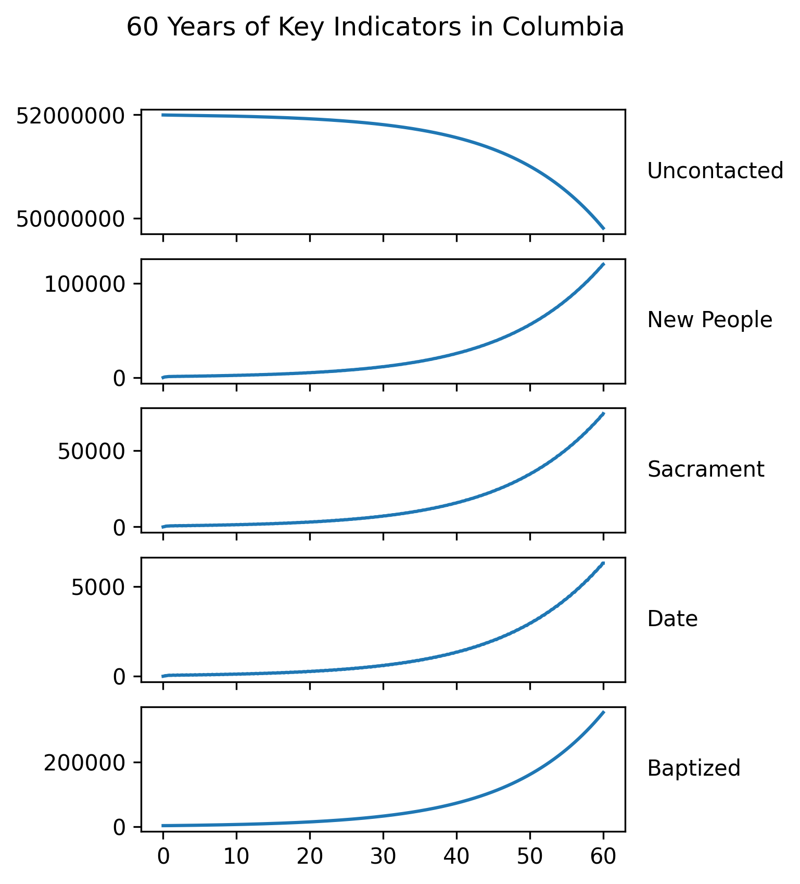
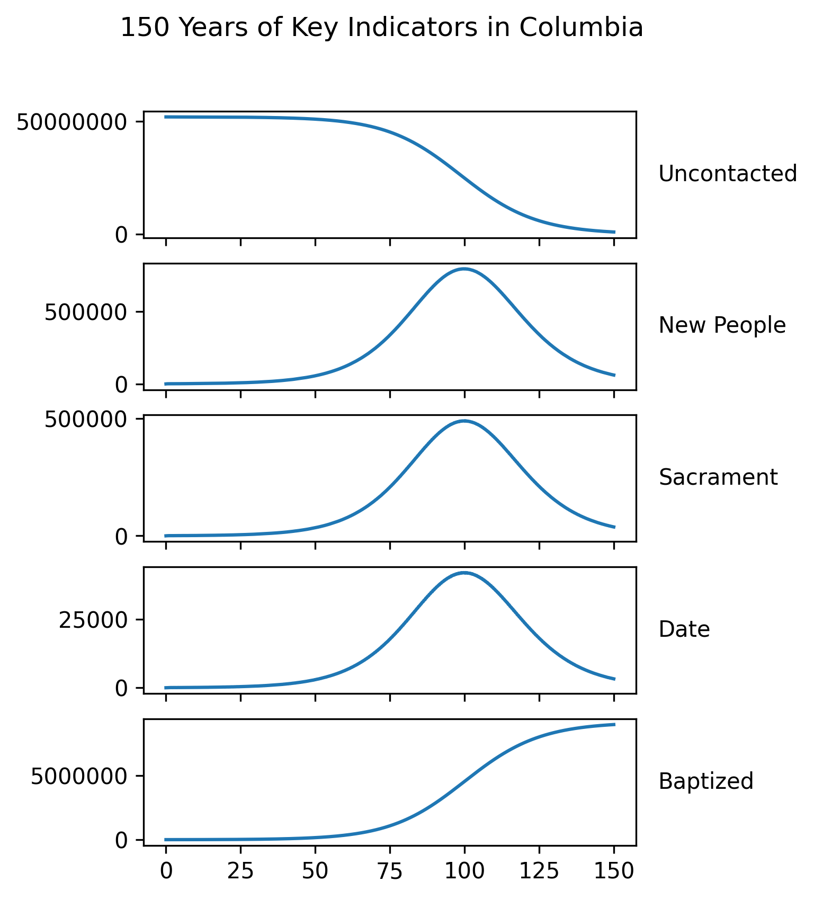

# Abstract

Using data key indicator data generated by The Church of Jesus Christ of Latter-Day Saints' missionaries this paper studies the potential for modeling the growth of church membership (both in local regions and on a global scale) using a simple modifcation of the SIR model. This model exhibits many of the qualitative behaviors experienced by the missionaries on a local scale, and is capable of giving reasonable estimates for church membership growth in a local region over the short term. As a result of numerical instability, a plethora of additional variables, and the significantly time scales the model stuggles to predict long-term church membership. Using this simple model, however, the potential impacts of changes in the missionary program can be studied, and opportunites for potential growth may be found.

# Background / Motivation

The Church of Jesus Christ of Latter-Day Saints has approximately 70,000 missionaries in voluntary ecclesiasticaly service around the globe. To organize this massive coalition of young adults (usually 18-23 years old) in foreign countries, the church has a series of 'Key Indicators' that can effectively be thought of as steps in a conversion funnel.

- New People (number of individuals beginning to be taught by missionaries)
- Sacrament Attendances (number of individuals attending worship services)
- People on Date (number of individuals who have scheduled a day to join the church)
- Baptisms (number of individuals who have joined the church via baptism)

These key indicators are used as a metric of success by the missionary department, the missionaries themselves, and represent the experiences of the missionaries and those they teach. Decisions, even small ones, made by the missionary department affect tens of thousands of missionaires and indirectly hundreds of thousands, if not millions, of individuals around the world. The missionaries' key indicators inform and represent the impacts of these decisions.

A mathematical model that can simulate the impacts of these leadership decisions, prior to their enactment, would be invaluable in avoiding pitfalls and analyzing opportunities for growth. Indeed, the conversion funnel that the missionaries' key indicators represent is similar to those of other organziations including sales funnels, a population's conversion to a particular political or other philosophy, and (similar to both the benevolent and malevolent memetic means present in each of these examples) actual virues.

For this reason a modified version of the prototypical SIR model was used. Unlike the SIR model, however, the model develped here allows for individuals to progress forwards and backwards through the various key indicators. We believe that this is a more realistic model not only for the missionaries but also various other phenomena such as the ones mentioned above. Ultimately our goal is two-fold, to model missionary key indicators, and thus church membership, over time. 

We are unaware of any previous efforts to model the missionaries' key indicators.

# Modeling

- α represents the rate at which uncontacted people become new people
- β represents the rate at which new people becomes those attending sacrament
- δ represents the rate at which those attending sacrament become those with a baptismal date 
- ε represents the rate at which those with a baptismal date are baptised
- γ represents the rate at which those with a baptismal date become those attending sacrament
- κ represents the rate at which those attending sacrament become new people
- λ represents the rate at which new people become uncontacted people
- η represents the birth rate of the uncontacted population
- ω represents the birth rate of the baptised population

This model is a slight adaptation of the prototypical SIR model which typically only allows for foward movement of progression of individuals through states. This model not only allows for backwards movement but it allows for it at every step. The original estimation for these paramaters came from personal anecdotal evidence and immediately produced results that match qualitative experience.

The same model used to predict the number of individuals in each key indicator state for the whole of Columbia. The model was initialized with the same assumptions except for changing the total population to 52,000,000, the approximate population of Columbia.

When projecting for the next 60 years, but this time for all of Columbia, the model again seems to produce realistic estimates considering that in 1967 church membership in Columbia was approximately 3000 and ~ 50 years later in 2019 it was about 200,000. As seen above, this is approximately what the same model used to estimate local mission dynamics would have predicted. Only another 50 years of time will tell if the model will accurately predict the next 100 years in Columbia. 

When trying to fit the model to real world data, however, some of the parameters, which are intended to always be positive became negative. With the model no longer alegebraically representing anecdotal intution it was able

# Results

# Analysis and Conclusion

We believe that the adapated SIR model presented here is a reasonable choice for modeling church membership but perhaps an unreasonable choice for modeling missionary key indicators. Generally, we failed to accurately model the real world key indicator data that is available to us, particularly 'New People'. The data does not exhibit some of the behavior neccesary for the assumptions that the SIR model is based on, namely that individuals move from one key indicator to the next at a rate proprotional to their respective populations. The key indicators do not generally exhibit this behavior, namely with the population of those attending sacrament not increasing at a rate propotional to the population of new people.

We did, however, model church membership in a local area fairly accurately. Just as with virus modeling, and thus from an SIR perspective, this makes sense as we would expect a prosyletyzing church population to grow at a rate proportional to the number of members. Given the accuary of the model while predicting church membership, and the original SIR model's ability to predict the evolution of a system, this or a similar model may be capable of predicting the plateau of church membership.
